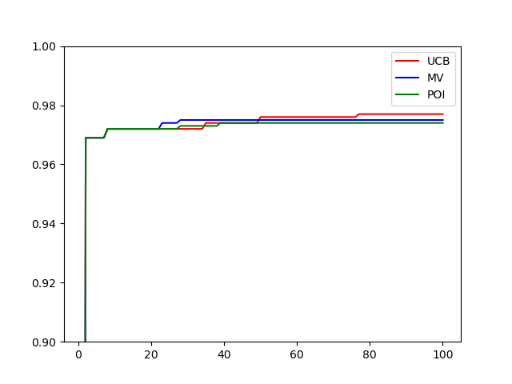

# Using Bayesian Optimisation to improve Hyperparameters 

## Project overview
This project sets out to demonstrate the suitability of Bayesian Optimisation as a tool to improve hyperparameters for a machine learning algorithm

## DATA
This project uses data from the famous MNIST dataset of handwritten digits.  As provided in the Kaggle competition here: https://www.kaggle.com/c/digit-recogniz

## MODEL 
The model being used is a simple neural network with two hidden layers and dropout.  The neuarl network starts with a 28x28 input, is fully connected to two hidden layers of the same depth, and then drops to an output of depth 10, represtening the ten digits 0-9.

## HYPERPARAMETER OPTIMSATION
The project then seeks to optimise the three hyperparameters as follow:
- learning rate (0.00001 to 0.5)
- depth of hidden layers (40 to 200)
- dropout rate (0 to 60%)

## RESULTS
The Bayesian Optimization improved the hyper parameters beyond the best from an initial random run of ten.  We tried three different acquisition functions UCB, max variance, and Prob of Improvement (0.05) and all of them managed to improve from hyper parameters with an accuracy of 0.9239, to optimal hyper parameters which gave an accuracy of over 0.97.

In this instance the maximum variance acquisition function got to better values the quickest, but UCB worked best in the long run.

